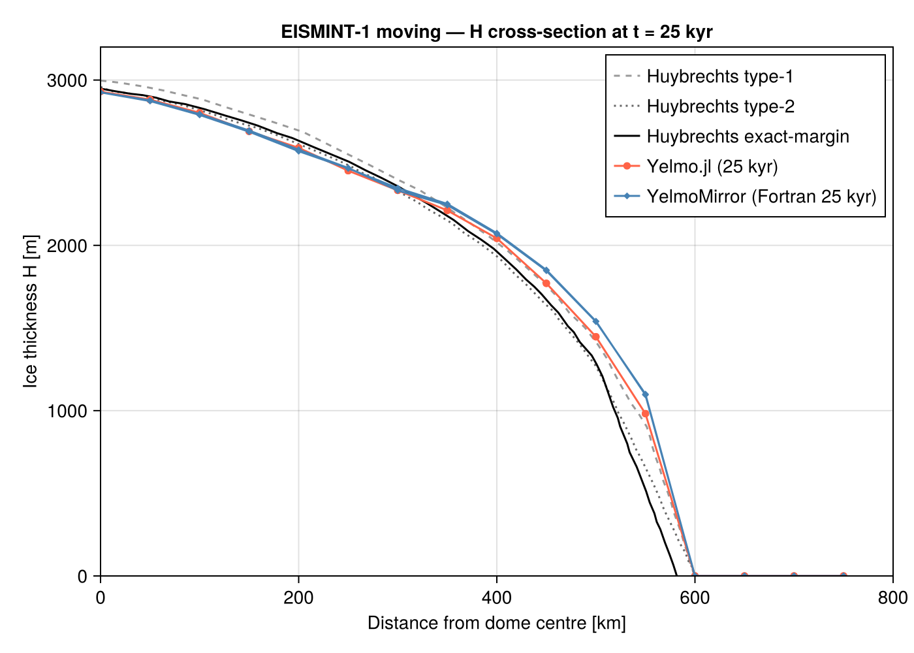
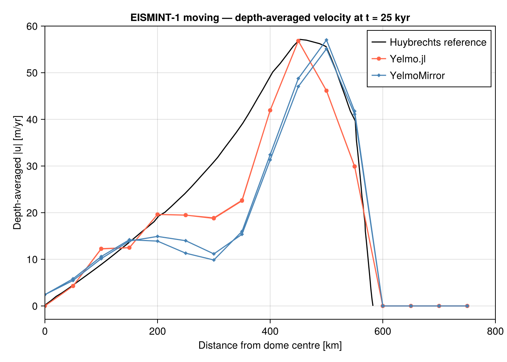
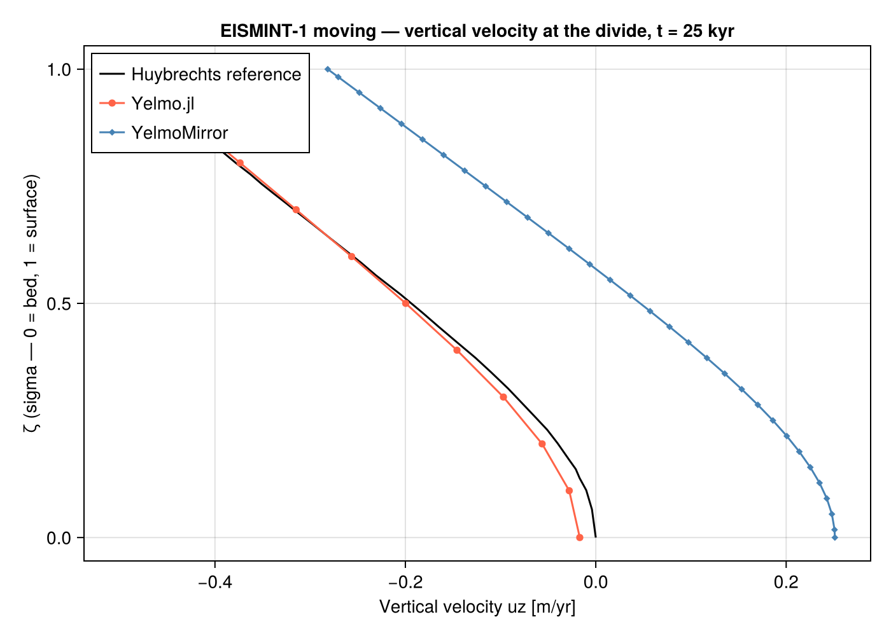

# EISMINT-1 Moving Margin

**Test files**: `test/benchmarks/test_eismint_moving.jl`,
`test/benchmarks/test_eismint_moving_lockstep.jl`  
**Fixture**: `test/benchmarks/fixtures/eismint_moving_t25000.nc`  
**Solver tested**: SIA + adaptive predictor-corrector timestepping  
**Validation**: Huybrechts (1996) type-1 / type-2 / exact-margin reference
profiles + YelmoMirror lockstep

## Setup

EISMINT-1 Moving Margin (Huybrechts et al. 1996, Experiment B1) is a
classic isothermal radial-ice-sheet benchmark.  A uniform circular
accumulation pattern drives ice growth on a flat bed; the equilibrium dome
is ~3 km tall with a margin at ~575 km.

| Parameter | Value |
|---|---|
| Domain | 31 × 31, `dx` = 50 km, symmetric about (775, 775) km |
| Glen exponent `n` | 3 |
| Rate factor `A` (`rf_const`) | 1 × 10⁻¹⁶ Pa⁻³ yr⁻¹ |
| SMB inside `R_el` | +0.5 m/yr |
| SMB outside `R_el` | `(r − R_el) × M_dot` (ablation ramp) |
| `R_el` | 450 km (radius of zero-mass-balance contour) |
| Steady-state time | ~25 kyr |

The thermodynamics module is bypassed (`ytherm.method = "fixed"`) so the
benchmark exercises only the SIA velocity + advection pipeline.

## What it tests

**`test_eismint_moving.jl`** — transient trajectory test to `t = 5 kyr`:

- SIA velocity solver producing finite `ux`, `uy`, `uz`.
- Vertical velocity from continuity (`uz_method = 3`).
- Explicit upwind advection of `H_ice` via `topo_step!`.
- Adaptive HEUN + PI42 timestepping under `dt_method = 2`.
- Mass conservation: total volume positive and growing.
- Dome forms at the geometric centre within 2 cells.

**`test_eismint_moving_lockstep.jl`** — full 25 kyr run + YelmoMirror
comparison:

- Steady-state `max(H)`, `mean(H)`, `max(uxy)` within a set tolerance
  of the Huybrechts type-2 reference values.
- Cell-by-cell `H_ice` / `uxy_bar` comparison against the committed
  YelmoMirror fixture at `t = 25 kyr`.

## Diagnostic figures

The figures below are from the full 25 kyr steady-state run in
`examples/eismint_moving_compare.jl` (Yelmo.jl in orange,
YelmoMirror / Fortran in blue, Huybrechts references in grey / black).

**Ice thickness cross-section** (`H` vs distance from dome centre):



Yelmo.jl and YelmoMirror agree closely and both fall between the
Huybrechts type-1 (dashed grey) and type-2 (dotted grey) envelopes,
bracketing the exact-margin reference (solid black).

**Depth-averaged velocity** (`|u|` vs distance from dome centre):



Peak velocity near the margin (~450 km) is well captured.  Both models
show the velocity peak slightly offset from the Huybrechts reference,
consistent with the coarse 50 km grid.

**Vertical velocity profile at the ice divide**:



Yelmo.jl (orange) matches the Huybrechts reference (black) closely
throughout the column.  YelmoMirror (blue) shows a larger residual
because the Fortran `uz_method` option differs from the Julia port's
vertically-integrated continuity approach.

## How to run

```bash
# 5-kyr transient test (fast, CI-friendly):
julia --project=test test/benchmarks/test_eismint_moving.jl

# Full 25-kyr lockstep comparison (requires the committed fixture):
julia --project=test test/benchmarks/test_eismint_moving_lockstep.jl

# Comparison plots (requires CairoMakie; produces figures/eismint_moving/*.png):
julia --project=test examples/eismint_moving_compare.jl
```

## Benchmark struct

```julia
include("test/benchmarks/helpers.jl")
using .YelmoBenchmarks

b = EISMINT1MovingBenchmark()   # Nx=Ny=31, dx=50 km, summit at (775,775) km
s = state(b, 0.0)               # NamedTuple of analytical IC fields
y = YelmoModel(b, 0.0; p=p, boundaries=:bounded)
```
